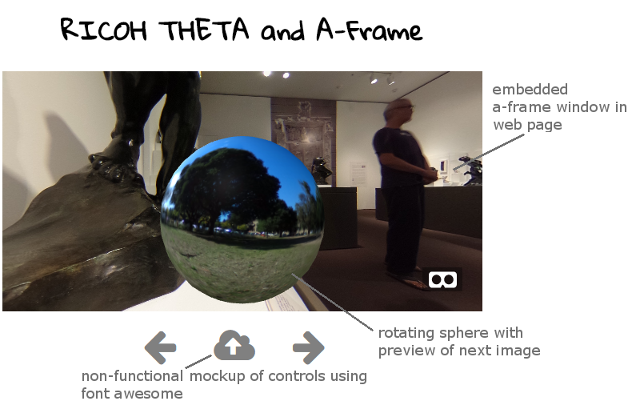

# A-Frame Embedded Test of RICOH THETA Images

A-Frame usually runs in VR headsets or as a fullscreen display on a mobile phone. If you want to have an embedded window, you need to use the `<a-scene embedded>` tag. The size
of the embedded window
is controlled with CSS.

Example:

    a-scene {
        height: 300px;
        width: 600px;
        margin: auto;
    }

Rotation of the preview sphere is handled with `a-animation`

Example:

    <a-animation attribute="rotation"
        dur="9000"
        from="0 0 0"
        to="0 360 0"
        repeat="5">
        </a-animation>

If you run this locally, you'll need to use something like httpster or fenix web server to get the images to display. Any web server will work. The image won't be displayed if you open index.html as a file in your browser.